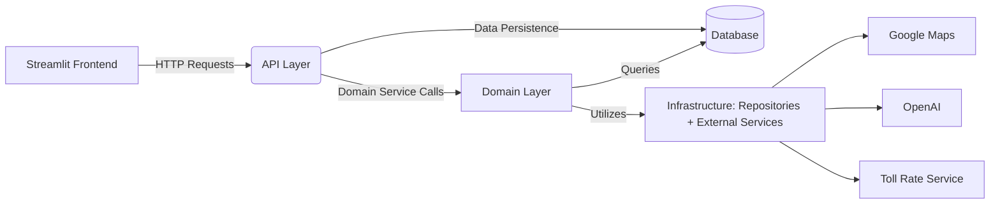

# LoadApp.AI – Current System Architecture

Version: 1.0  
Last Updated: January 2025

## Overview

LoadApp.AI is a platform designed to manage and optimize transport operations—specifically focusing on cargo management, route planning (with optional empty driving segments), cost calculations, and offer generation. This document provides an overview of the system in its current state. It follows Clean Architecture principles, ensuring a clear separation of concerns and a foundation for scalability.

---

## Architectural Layers

1. Frontend  
2. API Layer  
3. Domain Layer  
4. Infrastructure Layer  
5. Database  
6. External Services

---

## 1. Frontend

### Description
Currently, the frontend is a minimal Streamlit application. It collects user inputs (cargo details, route origins/destinations, etc.), displays basic route and cost information, and offers rudimentary visualization of timeline events. Though plans may exist to migrate to a more robust framework like React or Vue, the current state remains primarily a Streamlit-based UI.

### Key Functions Implemented
• Cargo entry form (weight, value, special requirements)  
• Route form (origin, destination, pickup/delivery time)  
• Trigger cost and offer generation  
• Display timeline events for routes (pickup, rest, delivery)  
• Basic error messages from backend responses

### Technologies
• Python 3.12 (or 3.10/3.11 depending on environment)  
• Streamlit for UI  
• Folium / streamlit-folium for map integration

---

## 2. API Layer

### Description
A Flask-based (or FastAPI-based) HTTP layer exposes endpoints under /api/ for the application. These endpoints coordinate requests from the frontend to the domain services, returning JSON responses.

### Key Endpoints
• /api/cargo → CRUD for Cargo entities  
• /api/route → Create, retrieve, and update route details  
• /api/cost → Setup cost components (CostSettings) and retrieve cost breakdowns:
  - POST /api/cost/settings/{route_id} → Create cost settings
  - GET /api/cost/settings/{route_id} → Get cost settings
  - POST /api/cost/settings/{target_route_id}/clone → Clone settings from another route
  - PATCH /api/cost/settings/{route_id} → Partially update cost settings
  - POST /api/cost/calculate/{route_id} → Calculate costs with current settings
• /api/offer → Generate and manage offers  
• /api/transport → List and select transport types
• /api/location → Location management and geocoding:
  - POST /api/location → Create location with geocoding
  - GET /api/location/{location_id} → Get location details
  - POST /api/location/validate → Validate address with geocoding

### Responsibilities
• Light request validation (JSON format, required fields)  
• HTTP-specific concerns and error codes  
• Conversion between HTTP and domain layer formats  
• No direct database operations or business logic  
• Error response formatting and HTTP status codes  
• (Optional) Authentication stubs for token-based security (PoC may not fully enforce)

---

## 3. Domain Layer

### Description
This layer holds the core entities, services, and business logic that represent real-world transport management concepts. All business rules and data processing are encapsulated here, independent of the API layer.

### Key Entities
• Cargo – Goods to be transported (weight, volume, cargo_type, etc.)  
• BusinessEntity – Company/business details (name, certifications, etc.)  
• Location – Geographical coordinates and address:
  - Supports address validation and geocoding
  - Provides latitude/longitude coordinates
  - Used in routes, timeline events, and segments
  - Integrates with Google Maps for validation
• Route – A path including timeline events & country segments  
• TransportType – Catalog of truck/driver specs (fuel consumption, certifications)  
• Transport – References a chosen TransportType and an associated BusinessEntity  
• CostSettings – User-defined or system-defined cost components and rates:
  - Supports cloning from existing routes
  - Rate validation with min/max constraints
  - Business entity-specific overrides
  - Partial updates with field-level validation
  - Component-specific rate validation rules
• CostBreakdown – Computed cost details including:
  - Fuel costs by country
  - Toll costs by country (with business-specific overrides)
  - Detailed driver costs (base, regular hours, overtime)
  - Overhead costs
  - Event costs
• TollRateOverride – Business-specific toll rate adjustments:
  - Vehicle class-based overrides
  - Country-specific multipliers
  - Optional route type specifications
• Offer – Proposed transport offer with margin calculations and optional AI enhancements

### Driver Cost Model
The system implements a sophisticated driver cost calculation model:
• Base daily rate for standard workdays
• Time-based rates for regular driving hours
• Overtime calculation with configurable multiplier (default 1.5)
• Maximum regular driving hours per day (default 9)
• Automatic multi-day cost calculation
• Country-specific rate validation
• Support for different rate types:
  - Base daily rate (100.00 - 500.00 EUR/day)
  - Driving time rate (10.00 - 100.00 EUR/hour)
  - Overtime calculated using configurable multiplier

### Rate Types & Validation
The system supports various rate types with validation:
• FUEL_RATE (0.50 - 5.00 EUR/L)
• TOLL_RATE (0.10 - 2.00 EUR/km)
• DRIVER_BASE_RATE (100.00 - 500.00 EUR/day)
• DRIVER_TIME_RATE (10.00 - 100.00 EUR/hour)
• DRIVER_OVERTIME_RATE (calculated using multiplier)
• EVENT_RATE (20.00 - 200.00 EUR/event)

Each rate type has:
• Minimum and maximum allowed values
• Country-specific flag
• Certification requirements flag
• Validation rules enforcement
• Support for partial updates and validation

### Service Layer Design
The service layer follows these principles:
• Encapsulates all business logic and rules
• Handles database transactions and rollbacks
• Manages detailed error handling and logging
• Uses dependency injection for repositories
• Maintains clean separation from API layer
• Provides domain-specific error types
• Handles data validation and business rules

### Key Services
• BusinessService:
  - Lists active business entities
  - Validates certifications and operating countries
  - Handles database transactions and rollbacks
  - Provides business entity management (PoC: limited implementation)

• LocationService:
  - Manages location creation and validation
  - Handles geocoding through Google Maps integration
  - Validates addresses before creation
  - Provides location lookup functionality
  - Supports route and timeline event locations

• RouteService:
  - Creates and validates routes
  - Manages timeline events
  - Tracks status transitions
  - Coordinates with other services for validations

• CostService:
  - Manages cost calculations and validations
  - Handles rate validation against schemas
  - Supports cost settings cloning
  - Processes driver cost breakdowns
  - Manages country-specific costs
  - Handles toll rate overrides
  - Validates component-specific rates

• OfferService:
  - Combines cost data
  - Applies margin calculations
  - Manages offer status transitions
  - Integrates AI content generation
  - Validates margin percentages

• TransportService:
  - Links TransportType to business entities
  - Validates transport capabilities
  - Manages transport availability
  - Handles transport-specific validations

### Service Layer Interactions
• Services communicate through well-defined interfaces
• Each service focuses on its specific domain
• Cross-service validations are coordinated
• Database operations are handled within services
• Error handling is consistent across services
• Logging follows standard patterns
• External service calls are abstracted

### Interactions
• RouteService calls BusinessService to validate certifications if needed  
• CostService may connect to toll rate calculations via infrastructure services & data from the route  
• OfferService uses AI content generation through an external port (OpenAI)  
• TransportService consults business constraints for availability and compliance

---

## 4. Infrastructure Layer

### Description
This layer provides implementations for data persistence (repositories), external service integrations (OpenAI, Google Maps), logging, and other cross-cutting concerns.

### Major Components

#### Repositories
• CargoRepository  
• BusinessRepository  
• RouteRepository  
• TransportRepository  
• CostRepository  
• OfferRepository  

Repositories handle CRUD operations and queries on behalf of the domain services.

#### External Services
• GoogleMapsService – For route distances/durations and country segmentation  
• OpenAIService – For AI-generated content in offers  
• TollRateService – For toll cost calculations by country and vehicle class

#### Logging
• Standard Python logging or structlog-based solution  
• Configured to capture errors, warnings, and debug info

#### Exceptions
• ExternalServiceError – General class for external errors  
• OpenAIServiceError, TollRateServiceError, GoogleMapsServiceError – Specific to each integration

---

## 5. Database

### Description
The system currently uses SQLAlchemy models and migrations with Alembic to manage schema changes. The database can be SQLite in local development or PostgreSQL in production.

### Key Tables
• cargos  
• business_entities  
• locations  
• routes  
• transports  
• transport_types  
• driver_specifications (enhanced with time-based cost fields):
  - daily_rate (base daily compensation)
  - driving_time_rate (hourly rate for driving)
  - overtime_rate_multiplier (default 1.5)
  - max_driving_hours (default 9)
  - required_license_type
  - required_certifications
• cost_settings  
• cost_breakdowns (with detailed driver costs):
  - base_cost
  - regular_hours_cost
  - overtime_cost
  - total_cost
• toll_rate_overrides:
  - vehicle_class
  - rate_multiplier
  - country_code
  - route_type
  - business_entity_id
• offers  
• status_history tables (cargo_status_history, route_status_history, offer_status_history)

---

## 6. External Services

### Google Maps Service
• Integration: RouteService → obtains path, distance, country segments  
• Failure: Handled by retries or fallback logic (PoC might be minimal)

### OpenAI Service
• Integration: OfferService → Enhances textual content or provides fun facts  
• Failure: Might default to empty strings or generic placeholders

### Toll Rate Service
• Integration: CostService → Tolls based on vehicle class/euro emission, kilometers traveled  
• Features:
  - Base toll calculation by country and vehicle class
  - Euro emission class adjustments
  - Business-specific rate overrides
  - Vehicle class-based multipliers
• Failure: Error passed up to cost calculation

---

## 7. Interaction Flow

1. User enters data in Streamlit (origin, cargo weight, etc.).  
2. The UI sends requests to the API endpoints (e.g., /api/cargo, /api/route).  
3. The API Layer forwards calls to the relevant domain service.  
4. The Domain Service executes logic (validations, calculations) and uses Repositories or External Services.  
5. Data is stored or retrieved from the Database via Repositories.  
6. If needed, external calls (maps, AI, tolls) are made.  
7. The Domain Service returns a result to the API layer.  
8. The API layer responds with JSON, which the Streamlit frontend displays.  
9. Errors or exceptions are logged for debugging; partial rollback or default behaviors may apply.

---

## 8. Diagrammatic Representation

Below is a simplified Mermaid diagram of the current system.  
Each arrow indicates the flow of data or calls between components.

> Note: This diagram highlights only the major interactions in the current PoC-level implementation. Additional error-handling steps are omitted for brevity.

---

## 9. Security Considerations

- Minimal or optional authentication in place for PoC frontends  
- Basic JWT logic or placeholder security for future expansions  
- Data input validation primarily at the domain level  
- Dev environment secrets managed via .env files; production might need a stronger secrets management approach

---

## 10. Scalability & Maintainability

- **Modular Components**: Domain services are separated from infrastructure code to facilitate updates.  
- **Database Migrations**: Alembic used for schema evolution.  
- **Test Coverage**: Unit and integration tests exist for domain and infra layers, roughly 60% coverage.  
- **Logging**: Basic structured logging with scope for improvement as the platform expands.

---

## 11. Potential Next Steps

- More robust UI framework (React or Vue)  
- Strengthened authentication/authorization mechanism  
- Enhanced route optimization logic  
- Real-time tracking integration (GPS data)  
- Fine-tuning of AI content generation (fun facts, cargo disclaimers, marketing text)

---

## Conclusion

This document outlines the LoadApp.AI system as it operates today. The architecture is designed around clean, modular principles, balancing a minimal PoC user interface, comprehensive back-end services, and well-defined domain logic. Over time, the platform can be extended with more sophisticated frontend features, advanced route optimizations, and refined security to handle larger volumes of data and more complex transport requirements. 