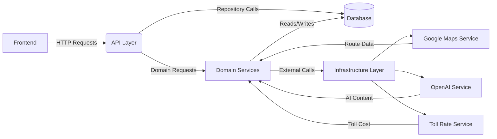

# LoadApp.AI - System Architecture

Version: 1.0  
Last Updated: January 2025

## Overview

LoadApp.AI is a comprehensive platform designed to manage and optimize transport routes, cargo management, cost calculations, and offer generation. This document provides a detailed overview of the system's architecture, outlining the primary components, their responsibilities, and the interactions between them. The architecture follows **Clean Architecture** principles, ensuring a clear separation of concerns, scalability, and maintainability.

## Architectural Layers

1. **Frontend**
2. **API Layer**
3. **Domain Layer**
4. **Infrastructure Layer**
5. **Database**
6. **External Services**

---

## 1. Frontend

### Description
The frontend is the user-facing component of LoadApp.AI, facilitating interactions between users and the system. It is responsible for collecting user inputs, displaying data visualizations, managing user sessions, and providing a seamless user experience.

### Technologies
- **Framework**: React.js (proposed)
- **State Management**: Redux
- **UI Library**: Material-UI or Tailwind CSS
- **Mapping**: Leaflet or Google Maps Integration
- **Hosting**: Vercel or Netlify

### Key Components
- **Cargo Management**: Forms for creating and updating cargo details.
- **Route Planner**: Interface for inputting origin/destination and visualizing routes.
- **Cost Calculator**: Dashboard to toggle cost components and view breakdowns.
- **Offer Generator**: Section to generate and view transport offers.
- **Notifications**: Real-time feedback for user actions and system events.

---

## 2. API Layer

### Description
The API layer serves as the intermediary between the frontend and the backend services. It handles HTTP requests, routes them to appropriate domain services, and returns responses to the frontend.

### Technologies
- **Framework**: FastAPI or Flask
- **Authentication**: JWT-based token system
- **Documentation**: Swagger UI integrated via `api_endpoints.md`

### Key Endpoints
- **/api/cargo**: CRUD operations for cargo entities.
- **/api/route**: Route creation, retrieval, and status management.
- **/api/cost**: Cost settings and breakdown calculations.
- **/api/offer**: Offer generation and management.
- **/api/transport**: Transport types listing and transport instance management.

### Responsibilities
- **Request Validation**: Ensuring incoming data adheres to required formats and constraints.
- **Error Handling**: Standardizing error responses based on `api_endpoints.md`.
- **Authentication Enforcement**: Securing endpoints that require user authentication.

---

## 3. Domain Layer

### Description
The domain layer encapsulates the core business logic and rules of LoadApp.AI. It defines the primary entities, their relationships, and the services that manipulate these entities.

### Key Entities
- **Cargo**: Represents goods being transported, including details like weight, volume, type, and value.
- **BusinessEntity**: Represents a business using the platform, containing information such as name, address, and certifications.
- **Location**: Geographical points with coordinates and addresses.
- **Route**: Defines the path from origin to destination, including timeline events and country segments.
- **TransportType**: Static configurations of transport options (e.g., Flatbed, Container).
- **Transport**: Runtime instances linking a TransportType to a BusinessEntity.
- **CostSettings**: Configuration for cost calculations based on enabled components and rates.
- **CostBreakdown**: Detailed breakdown of costs associated with a route.
- **Offer**: Represents a transport offer, including final pricing and AI-enhanced content.

### Key Services
- **BusinessService**: Manages validations related to business entities, such as certifications and operating countries.
- **RouteService**: Handles route creation, validation, and timeline event management.
- **CostService**: Manages cost calculations, including fuel, tolls, driver costs, and overheads.
- **OfferService**: Generates transport offers, applies margins, and integrates AI-enhanced content.
- **TransportService**: Manages transport entities and ensures they align with business requirements.

### Interactions
- **RouteService** interacts with **BusinessService** to validate business constraints.
- **CostService** utilizes **TollRateService** (infrastructure) for toll calculations.
- **OfferService** integrates with **OpenAIService** for content enhancement.
- **TransportService** ensures that transport selections comply with business certifications via **BusinessService**.

---

## 4. Infrastructure Layer

### Description
The infrastructure layer provides the necessary tools and services that support the domain layer. It includes database interactions, external service integrations, and repository implementations.

### Components

#### 4.1 Repositories
- **CargoRepository**
- **BusinessRepository**
- **RouteRepository**
- **TransportRepository**
- **CostRepository**
- **OfferRepository**

##### Responsibilities
- **Data Persistence**: Interacting with the database to create, read, update, and delete entities.
- **Data Retrieval**: Fetching entities based on specific queries or relationships.

#### 4.2 External Services
- **Google Maps Service**: Calculates routes, distances, durations, and country segments.
- **OpenAI Service**: Generates AI-enhanced content for offers and fun facts.
- **Toll Rate Service**: Calculates toll costs based on country-specific rates and transport specifications.

##### Responsibilities
- **API Integration**: Communicating with third-party APIs to fetch or send data.
- **Error Handling**: Managing external service failures with retries and fallbacks.
- **Data Transformation**: Converting external data formats to internal representations.

#### 4.3 Exceptions
- **ExternalServiceError**: Base class for external service-related exceptions.
- **OpenAIServiceError**, **TollRateServiceError**, **GoogleMapsServiceError**: Specific exceptions for respective services.

#### 4.4 Logging
- **Structured Logging**: Implements consistent and structured logs across all services and repositories.
- **Log Levels**: Utilizes Info, Warn, and Error levels appropriately to categorize log messages.

---

## 5. Database

### Description
The database layer stores all persistent data required by LoadApp.AI. It ensures data integrity, supports relationships between entities, and enables efficient data retrieval.

### Technology
- **Database System**: PostgreSQL or SQLite (depending on deployment)
- **ORM**: SQLAlchemy

### Schema Overview
- **Tables**:
  - `cargos`: Stores cargo details.
  - `business_entities`: Stores business entity information.
  - `locations`: Stores geographical locations.
  - `routes`: Stores route information, including references to cargos and transport.
  - `transport_types`: Stores definitions of transport options.
  - `transports`: Stores transport instances linked to business entities.
  - `cost_settings`: Stores cost calculation configurations.
  - `cost_breakdowns`: Stores detailed cost calculations.
  - `offers`: Stores transport offers.
  - Additional tables for status histories and specifications.

### Migrations
- **Alembic**: Used for managing database migrations.
- **Migration Scripts**: Located in the `migrations` directory, handling schema changes over time.

---

## 6. External Services

### 6.1 Google Maps Service

#### Description
Calculates routes, distances, durations, and segmentations based on geographical data.

#### Integration Points
- **RouteService**: Utilizes Google Maps for generating detailed route data.

#### Responsibilities
- **Route Calculation**: Determines optimal paths between locations.
- **Segment Identification**: Breaks down routes into country-specific segments.

### 6.2 OpenAI Service

#### Description
Enhances offer content through AI-generated descriptions and fun facts.

#### Integration Points
- **OfferService**: Interacts with OpenAI to generate engaging offer content.

#### Responsibilities
- **Content Generation**: Produces professional descriptions and engaging fun facts.
- **Error Handling**: Manages API rate limits and failures with retries.

### 6.3 Toll Rate Service

#### Description
Calculates toll costs based on transport specifications and country-specific rates.

#### Integration Points
- **CostService**: Uses Toll Rate Service for accurate cost breakdowns involving tolls.

#### Responsibilities
- **Toll Calculation**: Computes toll fees for specific routes and transport types.
- **Rate Management**: Maintains up-to-date toll rates per country and vehicle class.

---

## 7. Interaction Flow

1. **User Interaction**:  
   - Users interact with the **Frontend** to input transport and cargo details.

2. **API Request**:  
   - The **Frontend** sends HTTP requests to the **API Layer**.

3. **Domain Processing**:  
   - The **API Layer** routes requests to appropriate **Domain Services** based on the endpoint.

4. **Business Logic Execution**:  
   - **Domain Services** perform business logic, interacting with **Repositories** for data persistence and **External Services** for additional computations.

5. **Data Persistence**:  
   - **Repositories** handle CRUD operations with the **Database**, ensuring data integrity.

6. **External Calculations**:  
   - Services like **Google Maps**, **OpenAI**, and **Toll Rate Service** provide necessary data for route optimizations, content enhancements, and cost calculations.

7. **Response Delivery**:  
   - The **API Layer** compiles responses and sends them back to the **Frontend**, which then displays the information to the user.

8. **Error Handling & Logging**:  
   - Throughout the process, any errors are handled gracefully, with appropriate logging for monitoring and debugging purposes.

---

## 8. Diagrammatic Representation

> Below is a Mermaid diagram illustrating how the frontend, API layer, domain services, infrastructure components, and external services interact.  
> Each arrow indicates the flow of data or calls between components.  
> This diagram is meant as a high-level overview; individual sequence diagrams can further detail each flow.

> Note: Application logs, security configurations, and environment variables are implicit in each interaction but governed by the overarching architecture.

## 9. Security Considerations

- **Authentication & Authorization**:  
  - Implement JWT-based authentication to secure API endpoints.
  - Role-based access control (RBAC) to manage permissions.

- **Data Protection**:  
  - Encrypt sensitive data at rest and in transit.
  - Validate and sanitize all user inputs to prevent injection attacks.

- **External Service Security**:  
  - Secure API keys and secrets using environment variables and secret management tools.
  - Implement rate limiting and monitoring for external service interactions.

---

## 10. Scalability & Maintainability

- **Modular Design**:  
  - Each component and service is designed to be independent, facilitating easier maintenance and scalability.

- **Performance Optimization**:  
  - Efficient database indexing.
  - Caching strategies for frequent read operations.
  - Asynchronous processing for long-running tasks.

- **Continuous Integration & Deployment (CI/CD)**:  
  - Automated testing and deployment pipelines to ensure rapid and reliable releases.

- **Documentation & Knowledge Sharing**:  
  - Comprehensive documentation (e.g., `api_endpoints.md`, `system_architecture.md`, `implementation_gameplan.md`) to onboard new developers quickly and maintain consistency across the team.

---

## 11. Future Enhancements

- **Advanced Route Optimization**:  
  - Implement machine learning models to predict optimal routes based on historical data.

- **Real-Time Tracking**:  
  - Integrate GPS tracking for live monitoring of transports.

- **User Management**:  
  - Develop features for user roles, profiles, and permissions.

- **Analytics Dashboard**:  
  - Provide insights and reports on transport efficiencies, cost savings, and operational metrics.

---

## Conclusion

The LoadApp.AI system architecture is meticulously designed to ensure robust functionality, scalability, and an enhanced user experience. By adhering to Clean Architecture principles and leveraging powerful external services, the platform is well-equipped to meet current demands and adapt to future expansions.

For further details on each component, refer to the respective documentation files within the `g_docs` directory.

# End of Document 